# Turtle Paint Workshop
# 🎨🐢
## Step 1: Diagramming the project with Figma  

I opted to start with my Screen Structure (excluding the if save, for now)  

  

Then began planning my Class Structure (this is before adding paint() to its' own interface)  

  

## Step 2: Coding my turtle application

I started with my abstract Shape Class which would act as a Parent Class to Circle, Square and Rectangle.  

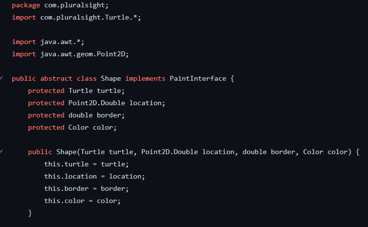

Then I added each of my Shapes  

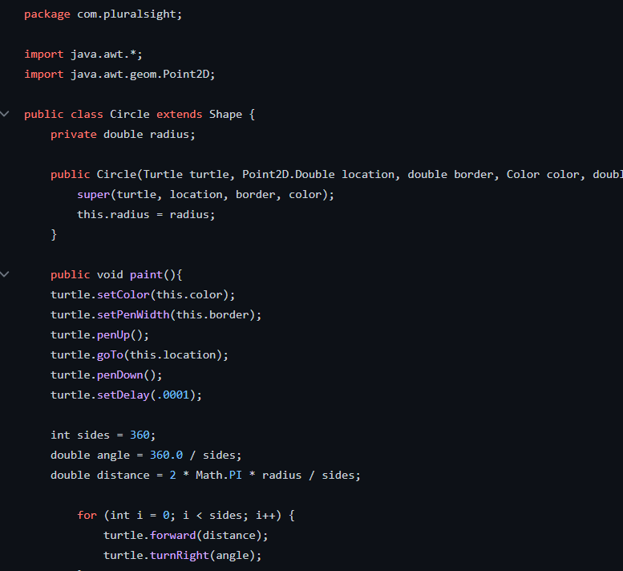  

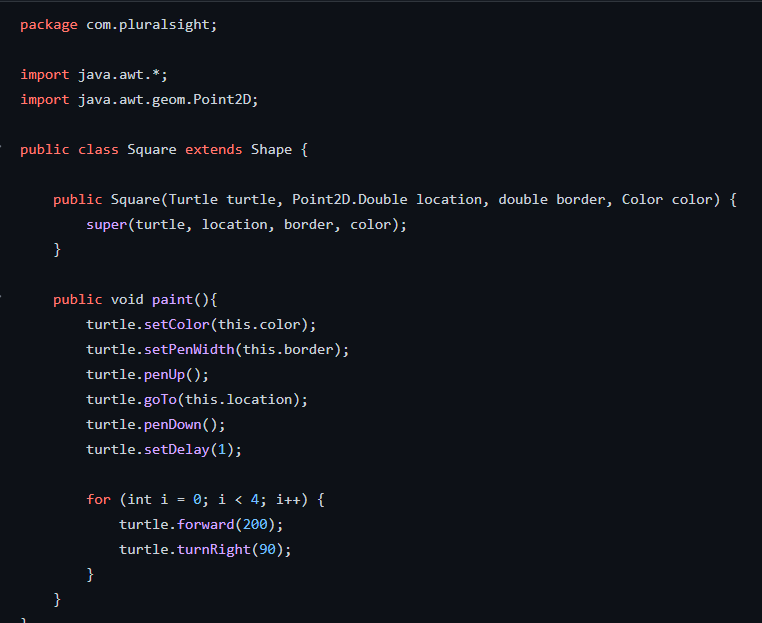  

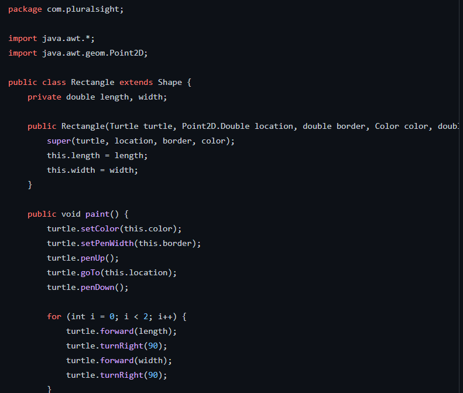

Next, it was time to set up the MainApp Class  

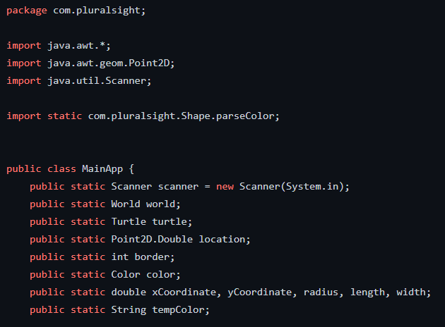  
Featuring a whole lot of class variables  

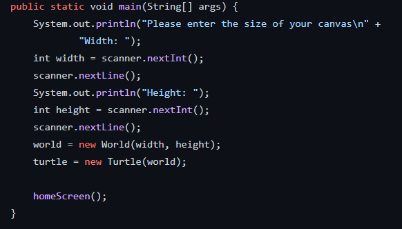  

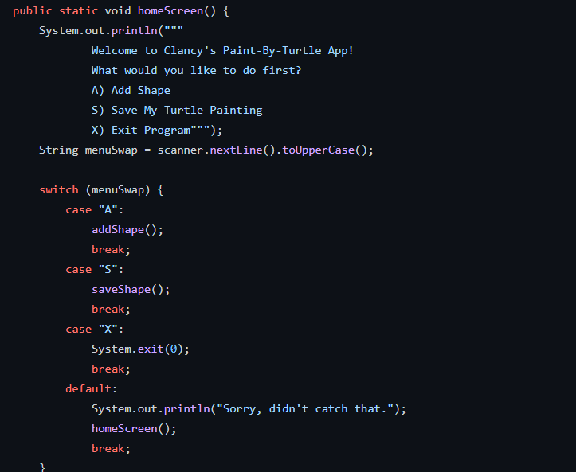  

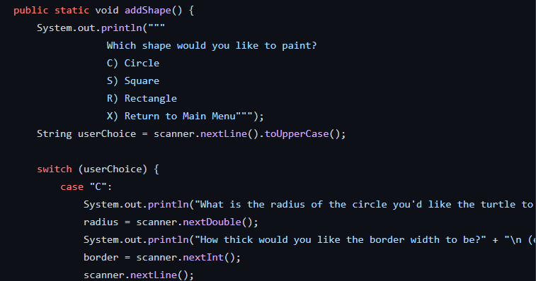  

At this point I decided to create a new method for turning my user's color choice (String) into and actual Color data type.  

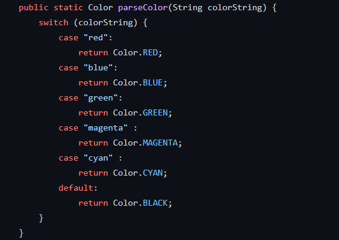

Now to create an interface for that paint() method  

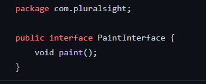

## Step 3: Running the App  

Let's launch this app and see what happens!  

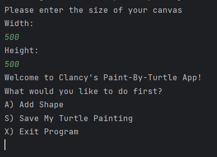

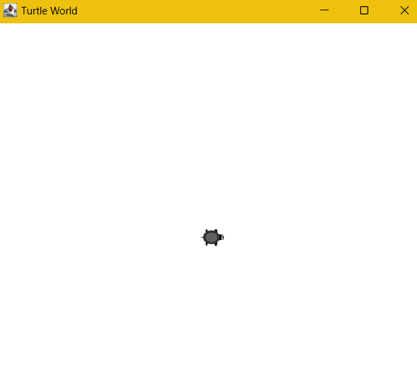  

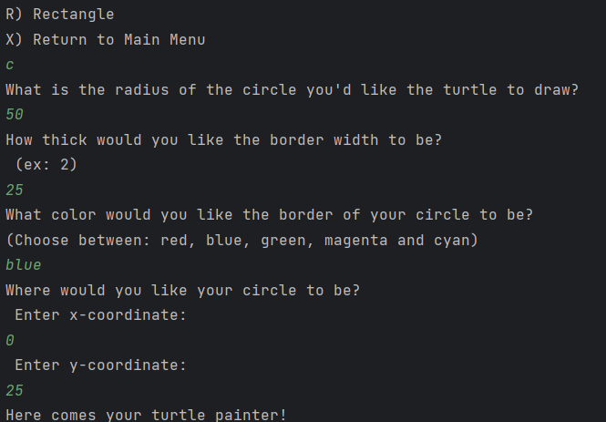

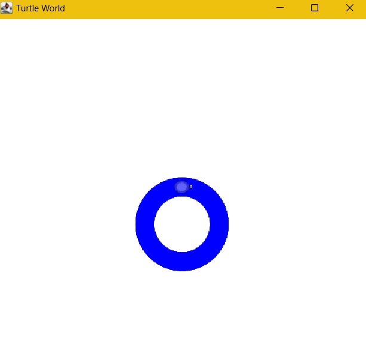

It works! But now we need to let our users save their masterpieces!  

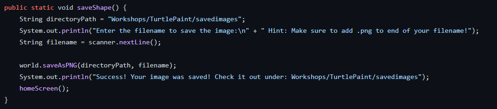

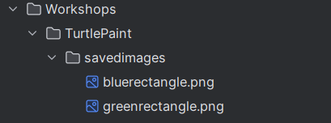  

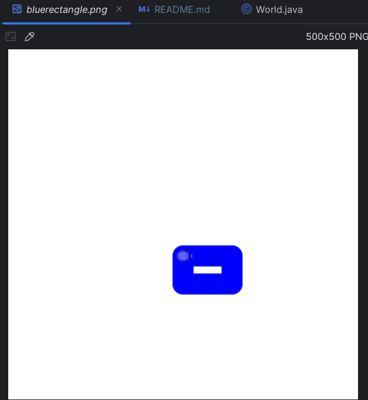

## Step 4: Relief!

Super proud of this project and had a blast creating it :)
